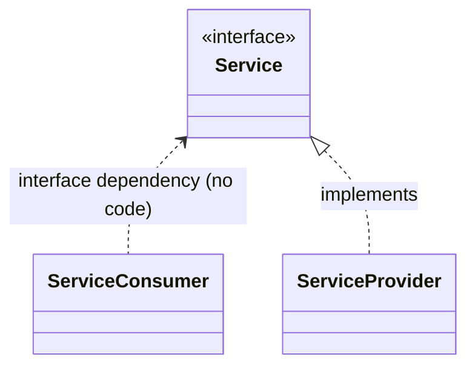

# Minimal Dependency Injection Framework for C++

This is a [**single file**](./dip.hpp) library for implementing the
[*dependency injection*](https://www.geeksforgeeks.org/dependency-injectiondi-design-pattern/)
pattern in C++, a technique for achieving
[*dependency inversion*](https://en.wikipedia.org/wiki/Dependency_inversion_principle):



instead of:


## Pattern implementation (library design)

- Dependency injection is not achieved by parameter passing,
  but using C++ template semantics.

- The library is declared within the `dip` namespace.
  To import the library:

  ```c++
  #include "dip.hpp"
  using namespace dip; // optional
  ```

- There are no *interfaces* in C++.
  A *service* **must** be declared as an
  [**abstract class**](https://en.cppreference.com/w/cpp/language/abstract_class)
  having a [**virtual destructor**](https://www.geeksforgeeks.org/cpp/virtual-destructor/).
  For example:

  ```c++
  class CustomService
  {
    virtual void doSomething() = 0;
    virtual ~CustomService() {};
  }
  ```

- Service providers are implemented as non-abstract descendants of services.
  For example:

  ```c++
  class CustomServiceProvider: public CustomService
  {
    virtual void doSomething() override { ... };
  }
  ```

  A single service provider may implement multiple services
  thanks to multiple inheritance, but this is **not recommended**:

  - Dependency injection becomes repetitive.
  - If necessary, you will have to write more custom code
    in order to inject the same service provider instance
    into all services.
    See [MultipleInheritanceExample.cpp](./Examples/MultipleInheritanceExample.cpp).

- There are **two service consumption modes**:

  1. Service providers injected using `dip::inject*()` methods
     are consumed using `dip::instance<Service>`.
     Just **one** service provider can be injected and consumed.
     See [InjectionExample.cpp](./Examples/InjectionExample.cpp).

  2. Service providers injected using `dip::add*()` methods
     are consumed using `dip::instance_set<Service>`.
     Many service providers can be injected and consumed.
     See [ProviderSetExample.cpp](./Examples/ProviderSetExample.cpp).

  If you want to use both modes simultaneously (for the same service),
  you have to inject the service provider twice using
  `dip::inject*()` *and* `dip::add*()` methods.

- *Service consumers* retrieve instances of a *service provider*
  by declaring them. Depending on the consumption mode:
  - `dip::instance<Service> service_provider;` or
  - `dip::instance_set<Service> service_provider_set;`

  The lifecycle of the service provider instance is automatically handled
  in a similar way to
  [`std::unique_ptr`](https://en.cppreference.com/w/cpp/memory/unique_ptr.html),
  but service provider instances are not moveable.

- To make use of a *service provider* instance just call a
  (virtual) service method using pointer syntax.
  For example:

  ```c++
  // First consumption mode
  service_provider->doSomething();

  // Second consumption mode
  for (auto provider: service_provider_set)
    provider->doSomething();
  ```

- You must inject all the required dependencies at **program startup**.
  An assertion will fail if a dependency is missing.
  In the first consumption mode,
  an assertion will fail if a dependency is injected twice.

- There are three predefined **life cycles** for instances of a service provider:

  - *Transient:*
    each service consumer gets a private instance of the service provider.
    To inject a transient service provider use
    `dip::inject_transient<Service,Provider>(constructor parameters)` or
    `dip::add_transient<Service,Provider>(constructor parameters)`
    depending on the consumption mode.

  - *Singleton:*
    all service consumers share a single instance of the service provider.
    To inject a singleton service provider use
    `dip::inject_singleton<Service,Provider>(constructor parameters)` or
    `dip::add_singleton<Service,Provider>(constructor parameters)`
    depending on the consumption mode.

  - *Thread singleton:*
    all service consumers running in the same thread
    share a single instance of the service provider.
    Service consumers running in different threads will never share
    the same instance of the service provider.
    To inject a thread singleton service provider use
    `dip::inject_thread_singleton<Service,Provider>(constructor parameters)` or
    `dip::add_thread_singleton<Service,Provider>(constructor parameters)`
    depending on the consumption mode.

- You can have any **custom lifecycle** by implementing
  an *injector* (see below).

> [!CAUTION]
> A service provider can consume instances of another service,
> but this could lead to **circular references**. Be very careful.
> See [InfiniteLoopExample.cpp](./Examples/InfiniteLoopExample.cpp)

### Injectors

An *injector* is an instance of `dip::Injector<Service>`
having two `std::function` members:

- `Service *acquire()`:

  - Retrieves a raw pointer to an instance of the service provider
    whenever it is requested.
  - Must not return `nullptr`.
  - The injector should determine if the instance is to be created or not
    and proceed accordingly.

- `void release(Service *instance)`

  - Where `instance` is a raw pointer to a service provider instance
    previously retrieved via `acquire()`.
    Note that this pointer is `Service *`, not `Provider *`.
    The injector should typecast this pointer to the service provider class.

  - Called whenever an instance of the service provider is no longer needed.

  - The injector should determine if the instance is to be destroyed or not
    and proceed accordingly.

To provide a custom injector for a service:

```c++
   Injector<Service> my_injector
   {
      .acquire = ...,
      .release = ...
   };
   dip::inject<Service>(my_injector); // First consumption mode
   dip::add<Service>(my_injector); // Second consumption mode
```

Example applications:

- Implementing a *single* service provider instance for *two or more* services
  (the service provider having multiple inheritance).
  See [MultipleInheritanceExample.cpp](./Examples/MultipleInheritanceExample.cpp).

- Implementing a pool of service provider instances retrieved in round robin.
  See [RoundRobinExample.cpp](./Examples/RoundRobinExample.cpp).
