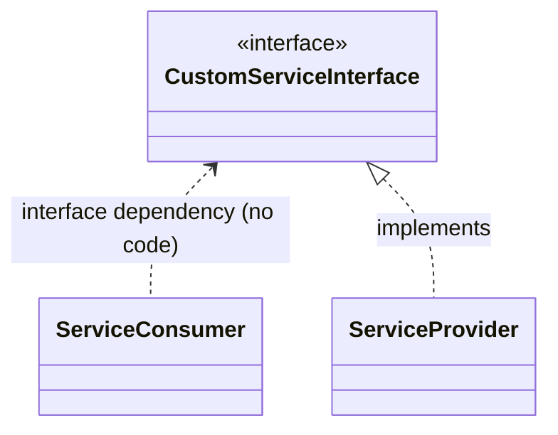
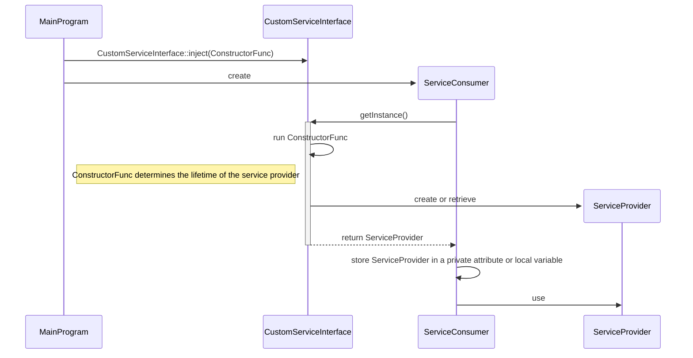
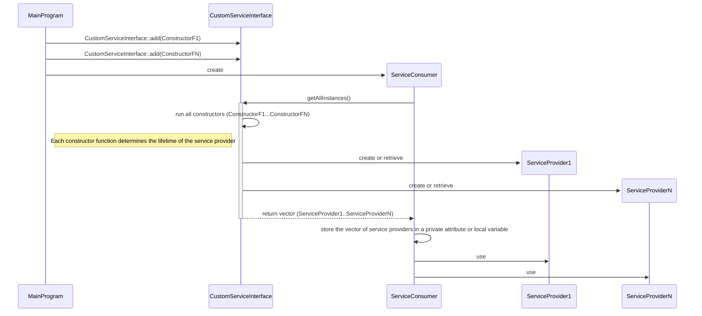

# Minimal Dependency Injection Framework for C++

This is a [**single file**](./InternalServices.hpp) library for implementing the
[*dependency injection*](https://www.geeksforgeeks.org/dependency-injectiondi-design-pattern/)
pattern in C++, a technique for achieving
[*dependency inversion*](https://en.wikipedia.org/wiki/Dependency_inversion_principle):



instead of:


## Pattern implementation (library design)

- Dependency injection is not achieved by parameter passing,
  but by a dependency manager.
  The dependency manager is static,
  so it is not necessary to pass it as a parameter either.

- The library is declared within the `InternalServices` namespace.
  To import the library:

  ```c++
  #include "InternalServices.hpp"
  using namespace InternalServices;
  ```

- There are no *interfaces* in C++.
  The *custom service interface* should be declared as an
  [**abstract class**](https://en.cppreference.com/w/cpp/language/abstract_class)
  to avoid any code dependencies. However, this is not enforced.
  For example:

  ```c++
  class CustomServiceInterface
  {
    virtual void doSomething() = 0;
  }
  ```

- Service providers are implemented as descendants of service interfaces.
  For example:

  ```c++
  class CustomServiceProvider: public CustomServiceInterface
  {
    virtual void doSomething() override { ... };
  }
  ```

  A single service provider can implement multiple service interfaces
  thanks to multiple inheritance, but this is **not recommended**:

  - Dependency injection becomes repetitive.
  - If necessary, you will have to write more custom code
    in order to inject the same service provider instance
    into all service interfaces.
    See [Example3.cpp](./Examples/Example3.cpp).

- The `DependencyManager<CustomServiceInterface>` type is a dependency
  manager for the `CustomServiceInterface` class:

  - Allows one or more service providers to be injected into the given
    `CustomServiceInterface`.

  - Retrives instances of the injected service providers for the service consumers.

  There is no need to create instances of each dependency manager,
  as all methods are
  [static member functions](https://en.cppreference.com/w/cpp/language/static).

- You have full control over the **lifetime** of each injected dependency
  thanks to `DependencyManager<CustomServiceInterface>::inject()`.
  This method accepts a **"constructor function"** where you choose
  how to create or retrieve the instance of a service provider.
  The [`std::shared_ptr<>`](https://en.cppreference.com/w/cpp/memory/shared_ptr) type
  handles its lyfecycle.
  Typically, the *constructor function* is a
  [lambda expression](https://en.cppreference.com/w/cpp/language/lambda).
  For example:

  ```c++
  DependencyManager<CustomServiceInterface>::inject(
    [](){
            return std::make_shared<ServiceProvider>();
        });
  ```

- For convenience, there is **templated** `inject()` (overloaded) method able to
  inject a service provider using one of its constructors (or the default).
  In the template parameters, you specify:

  - The service provider class or struct.

  - **A lifetime for the instances of the service provider**:

    - *Transient:*
      each service consumer gets a private instance of the service provider.

    - *Singleton:*
      all service consumers share a single instance of the service provider.

    - *Thread local:*
      all service consumers running in the same thread
      share a single instance of the service provider.
      Service consumers running in different threads will never share
      the same instance of the service provider.

  - **A consumption mode** for service consumers.
    Service consumers get one or more instances of their service providers
    thanks to `DependencyManager<>::getInstance()` or
    `DependencyManager<>::getAllInstances()`

    - Service providers injected with the `getInstance` mode
      are instantiated with `getInstance()`,
      but not with `getAllInstances()`.
    - Service providers injected with `getAllInstances` mode
      are instantiated with `getAllInstances()`,
      but not with `getInstance()`.
    - Service providers injected with `both` mode
      are instantiated with `getAllInstances()` and `getInstance()`.

For examples of dependency injection calls,
see [example1.cpp](./Examples/Example1.cpp).

- Service providers can declare parameters in the class constructor.
  However, it is a good practice to declare a single parameterless constructor
  (or none at all).

- A service interface can act as a dependency manager for itself
  by inheriting from the `DependencyManager<>` type.
  This is recommended but not mandatory.
  For example:

  ```c++
  class CustomServiceInterface: public DependencyManager<CustomServiceInterface>
  {
    ...
  }
  ```

  Some syntactic sugar is available:

  ```c++
  class SERVICE(CustomServiceInterface)
  {
    ...
  }
  ```

- Alternatively, you can declare a dependency manager for a set of services,
  but this is not mandatory either.
  See [Example3.cpp](./Examples/Example3.cpp).
  Typically:

    ```c++
    class DependencyManager : public DependencyManager<MyServiceInterface1>,
                              public DependencyManager<MyServiceInterface2>
    {
    public:
        using Service1 = DependencyManager<MyServiceInterface1>;
        using Service2 = DependencyManager<MyServiceInterface2>;
    };
    ```

- You must inject all the required dependencies at **program startup**.
  A runtime exception will be thrown if some dependency is missing.
  To detect missing dependencies ahead of time, call
  `DependencyManager<>::injected()` and/or `DependencyManager<>::injectedSize()`.

- A runtime exception is also thrown if a depedency is injected twice
  using a constructor function, the `getInstance` consumer mode, or
  the `both` consumer mode.

> [!CAUTION]
> A service provider can obtain and use an instance of another service provider,
> but this can lead to **circular references**. Be very careful.
> See [Example4.cpp](./Examples/Example4.cpp)

### Use cases

These use cases assume that `CustomServiceInterface` is derived from
`InternalServices::DependencyManager<CustomServiceInterface>`.

#### For service consumers in need of just one service provider:



See [Example1.cpp](./Examples/Example1.cpp).

#### For service consumers in need of all available service providers:



See [Example2.cpp](./Examples/Example2.cpp).

Other use cases are left to your imagination.

## Optimization

For the use case where:

- All service providers are singleton instances.
- All service consumers require just one service provider.

An optimized library is available.
Use the `SingletonServices` namespace instead of `InternalServices`.

```c++
#include "InternalServices.hpp"
using namespace SingletonServices;
```

Only `DependencyManager<>::getInstance()` is available to retrieve a service provider.
`DependencyManager<>::inject()` requires just a service provider (as a template parameter)
and the constructor parameters.

See [Example5.cpp](./Examples/Example5.cpp).
