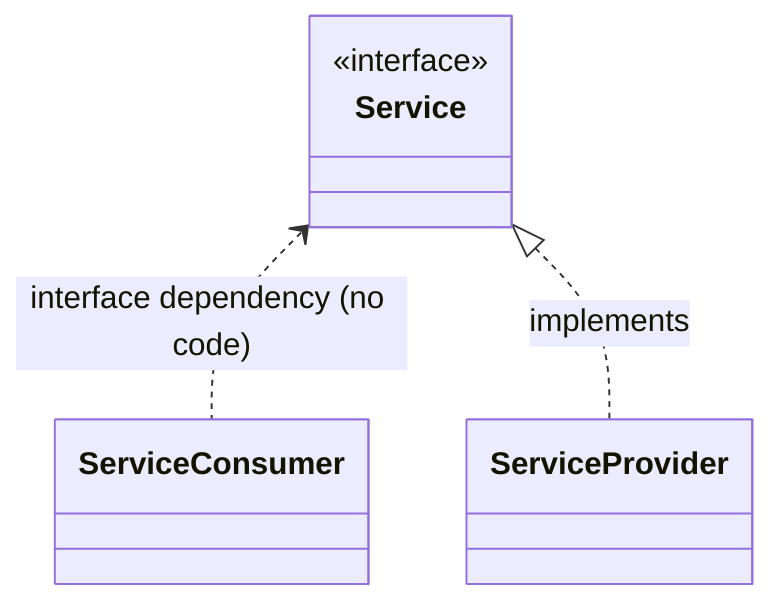

# Minimal Dependency Injection Framework for C++

This is a [**single file**](./InternalServices.hpp) library for implementing the
[*dependency injection*](https://www.geeksforgeeks.org/dependency-injectiondi-design-pattern/)
pattern in C++, a technique for achieving
[*dependency inversion*](https://en.wikipedia.org/wiki/Dependency_inversion_principle):



instead of:


## Pattern implementation (library design)

- Dependency injection is not achieved by parameter passing,
  but by a dependency manager.
  The dependency manager is static,
  so it is not necessary to pass it as a parameter either.

- The library is declared within the `dip` namespace.
  To import the library:

  ```c++
  #include "dip.hpp"
  using namespace dip; // optional
  ```

- There are no *interfaces* in C++.
  A *service* **must** be declared as an
  [**abstract class**](https://en.cppreference.com/w/cpp/language/abstract_class)
  having a [**virtual destructor**](https://www.geeksforgeeks.org/cpp/virtual-destructor/).
  For example:

  ```c++
  class CustomService
  {
    virtual void doSomething() = 0;
    virtual ~CustomService() {};
  }
  ```

- Service providers are implemented as non-abstract descendants of services.
  For example:

  ```c++
  class CustomServiceProvider: public CustomService
  {
    virtual void doSomething() override { ... };
  }
  ```

  A single service provider may implement multiple services
  thanks to multiple inheritance, but this is **not recommended**:

  - Dependency injection becomes repetitive.
  - If necessary, you will have to write more custom code
    in order to inject the same service provider instance
    into all services.
    See [MultipleInheritanceExample.cpp](./Examples/MultipleInheritanceExample.cpp).

- There are three predefined **life cycles** for instances of a service provider:

  - *Transient:*
    each service consumer gets a private instance of the service provider.
    To inject a transient service provider use
    `dip::inject_transient<Service,Provider>(constructor parameters)`.

  - *Singleton:*
    all service consumers share a single instance of the service provider.
    To inject a singleton service provider use
    `dip::inject_singleton<Service,Provider>(constructor parameters)`.

  - *Thread singleton:*
    all service consumers running in the same thread
    share a single instance of the service provider.
    Service consumers running in different threads will never share
    the same instance of the service provider.
    To inject a thread singleton service provider use
    `dip::inject_thread_singleton<Service,Provider>(constructor parameters)`.

- You can have any **custom lifecycle** by implementing
  an *injector* (see below).

- You must inject all the required dependencies at **program startup**.
  An assertion will fail if a dependency is missing or injected twice.

- *Service consumers* retrieve instances of a *service provider*
  by declaring them: `dip::instance<Service> service_provider;`.
  The lifecycle of the service provider instance is automatically handled
  in a similar way to
  [`std::unique_ptr`](https://en.cppreference.com/w/cpp/memory/unique_ptr.html),
  but service provider instances are not moveable.

- To make use of a *service provider* instance just call a (virtual) service method
  using pointer syntax.
  For example: `service_provider->doSomething();`.

> [!CAUTION]
> A service provider can consume instances of another service,
> but this could lead to **circular references**. Be very careful.
> See [InfiniteLoopExample.cpp](./Examples/InfiniteLoopExample.cpp)

### Injectors

An *injector* is an instance of `dip::Injector<Service>`
having two `std::function` members:

- `Service *retrieve()`:

  - Retrieves a pointer to an instance of the service provider
    whenever it is requested.
  - Must not return `nullptr`.
  - The injector should determine if the instance is to be created or not
    and proceed accordingly.

- `void forget(Service *instance)`

  - Where `instance` is a pointer to an instance of the service
    provider previously retrieved via `retrieve()`.
    The injector should typecast this pointer to the service provider class.

  - Called whenever an instance of the service provider is no longer needed.

  - The injector should determine if the instance is to be destroyed or not
    and proceed accordingly.

To inject an injector (sorry for the redundancy) into a service:

```c++
   Injector<Service> my_injector
   {
      .retrieve = ...,
      .forget = ...
   };
   instance<Service>::inject(my_injector);
```

Example applications:

- Implementing a *single* service provider instance for *two or more* services
  (the service provider having multiple inheritance).

- Implementing a pool of service provider instances retrieved in round robin.

---


- The `instance<Service>` type is a dependency
  manager for the `Service` class:

  - Allows one service provider to be injected into the given
    `Service`.

  - Retrieves instances of the injected service providers for the service consumers.

  There is no need to create instances of each dependency manager,
  as all methods are
  [static member functions](https://en.cppreference.com/w/cpp/language/static).

- You have full control over the **lifetime** of each injected dependency
  thanks to `DependencyManager<CustomServiceInterface>::inject()`.
  This method accepts a **"constructor function"** where you choose
  how to create or retrieve the instance of a service provider.
  The [`std::shared_ptr<>`](https://en.cppreference.com/w/cpp/memory/shared_ptr) type
  handles its lyfecycle.
  Typically, the *constructor function* is a
  [lambda expression](https://en.cppreference.com/w/cpp/language/lambda).
  For example:

  ```c++
  DependencyManager<CustomServiceInterface>::inject(
    [](){
            return std::make_shared<ServiceProvider>();
        });
  ```

- For convenience, there is a **templated** `inject()` (overloaded) method able to
  inject a service provider using one of its constructors (or the default).
  In the template parameters, you specify:

  - The service provider class or struct.

  - **A lifetime for the instances of the service provider**:

    - *Transient:*
      each service consumer gets a private instance of the service provider.

    - *Singleton:*
      all service consumers share a single instance of the service provider.

    - *Thread local:*
      all service consumers running in the same thread
      share a single instance of the service provider.
      Service consumers running in different threads will never share
      the same instance of the service provider.

  - **A consumption mode** for service consumers.
    Service consumers get one or more instances of their service providers
    thanks to `DependencyManager<>::getInstance()` or
    `DependencyManager<>::getAllInstances()`

    - Service providers injected with the `getInstance` mode
      are instantiated with `getInstance()`,
      but not with `getAllInstances()`.
    - Service providers injected with `getAllInstances` mode
      are instantiated with `getAllInstances()`,
      but not with `getInstance()`.
    - Service providers injected with `both` mode
      are instantiated with `getAllInstances()` and `getInstance()`.

For examples of dependency injection calls,
see [InjectionExample.cpp](./Examples/InjectionExample.cpp).

- Service providers can declare parameters in the class constructor.
  However, it is a good practice to declare a single parameterless constructor
  (or none at all).

- A service interface can act as a dependency manager for itself
  by inheriting from the `DependencyManager<>` type.
  This is recommended but not mandatory.
  For example:

  ```c++
  class CustomServiceInterface: public DependencyManager<CustomServiceInterface>
  {
    ...
  }
  ```

  Some syntactic sugar is available:

  ```c++
  class SERVICE(CustomServiceInterface)
  {
    ...
  }
  ```

- Alternatively, you can declare a dependency manager for a set of services,
  but this is not mandatory either.
  See [CustomDependencyManager.cpp](./Examples/CustomDependencyManager.cpp).
  Typically:

    ```c++
    class DependencyManager : public DependencyManager<MyServiceInterface1>,
                              public DependencyManager<MyServiceInterface2>
    {
    public:
        using Service1 = DependencyManager<MyServiceInterface1>;
        using Service2 = DependencyManager<MyServiceInterface2>;
    };
    ```

- You must inject all the required dependencies at **program startup**.
  A runtime exception will be thrown if some dependency is missing.
  To detect missing dependencies ahead of time, call
  `DependencyManager<>::injected()` and/or `DependencyManager<>::injectedSize()`.

- A runtime exception is also thrown if a depedency is injected twice
  using a constructor function, the `getInstance` consumer mode, or
  the `both` consumer mode.

> [!CAUTION]
> A service provider can obtain and use an instance of another service provider,
> but this can lead to **circular references**. Be very careful.
> See [InfiniteLoopExample.cpp](./Examples/InfiniteLoopExample.cpp)
